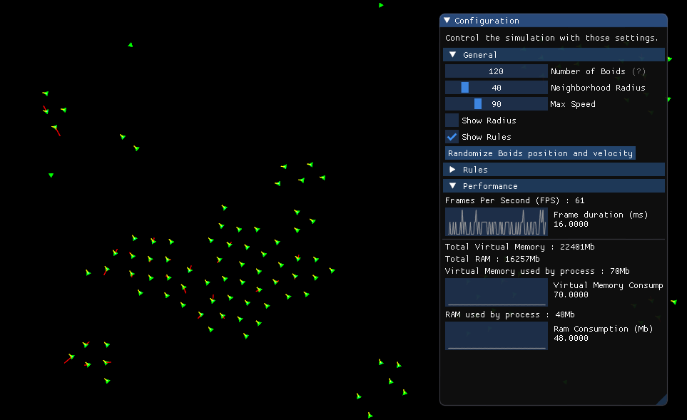
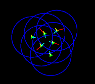

# Flocking Boids

This is a flocking boids simulation, based on [Craig Reynolds model](https://www.red3d.com/cwr/boids/), 
along with a few additional rules.

The application uses SFML as a graphic library, 
which path's must be added to CMake, and ImGui for the UI, 
that's already built into the project.

## The Application

You can change a wide array of parameters in runtime and 
observe the simulation :
- Number of Boids
- Neighborhood radius of boids
- Speed of boids
- Show/Hide the neighborhood radius and the rules forces on the boids.
- Each rule can be enabled/disabled, and have their weight 
and other parameters modified.

There's also a basic profiler to track the execution time and memory consumption.

## The Rules

The three core rules of Boids flocking are implemented :
- Cohesion : Boids steers to stay near each other.
- Separation : Boids steers to avoid colliding with each other.
- Alignment : Boids steers toward the same direction than others.

Along with some extra rules :
- Bounding Area : Boids steers to avoid the border of the windows.
(By default, they are warped to the other side when they reach the edge)
- Wind : Boids are applied a constant directional force.
- Tendency toward/away from a place : Boids steers to move away or toward 
the mouse position when the left click is held.

You can hide/display the resulting forces on each boids, has shown below.
(Yellow is Alignment, Red is Separation, and Cyan is Cohesion)

